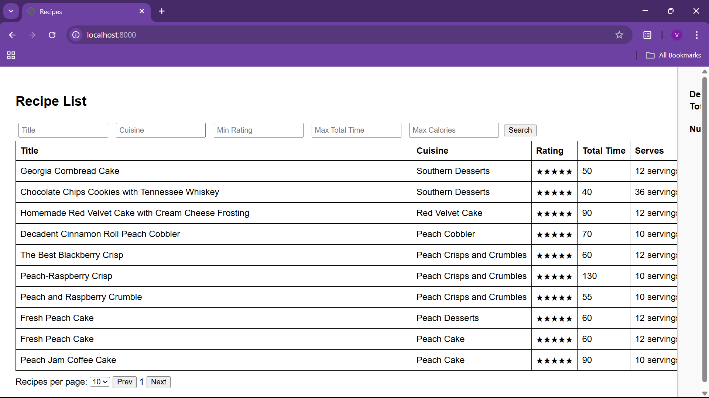
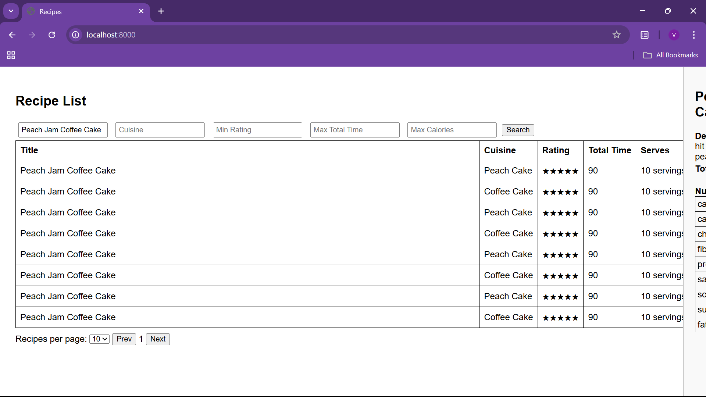
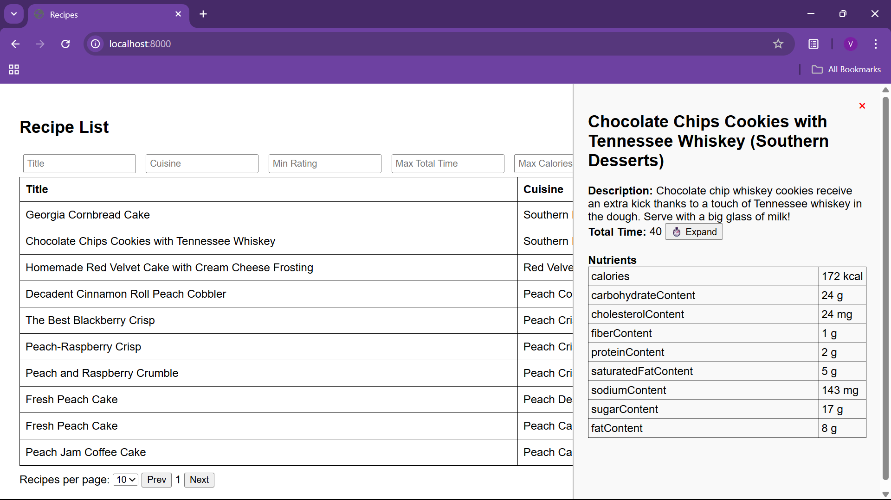

# 🍽️ Recipe API

This is a simple FastAPI backend for managing and filtering recipes. It supports search filtering, viewing detailed recipe descriptions, and includes nutritional information and preparation times.

## 🚀 Features

- View all available recipes
- Field-level search filtering (`/search`)
- Drawer-style detail view with:
  - Description
  - Nutrition information
  - Preparation and cooking time

## 🖼️ Screenshots

### 🔹 Main Page


### 🔹 Filter Page


### 🔹 Description (Cookie)


---

## ⚙️ Getting Started

### 1. Clone the Repository

```bash
git clone https://github.com/vaitheeshwarij14/recipe-api.git
cd recipe-api
```

### 2. Create and Activate Virtual Environment

#### On Windows

```bash
python -m venv venv
venv\Scripts\activate
```

#### On macOS/Linux

```bash
python3 -m venv venv
source venv/bin/activate
```

### 3. Install Dependencies

```bash
pip install -r requirements.txt
```

> If there's no `requirements.txt` file, install FastAPI and Uvicorn manually:
```bash
pip install fastapi uvicorn
```

---

## ▶️ Run the Server

```bash
uvicorn main:app --reload
```

Open your browser and go to: [http://127.0.0.1:8000](http://127.0.0.1:8000)

Interactive Swagger UI: [http://127.0.0.1:8000/docs](http://127.0.0.1:8000/docs)

---
